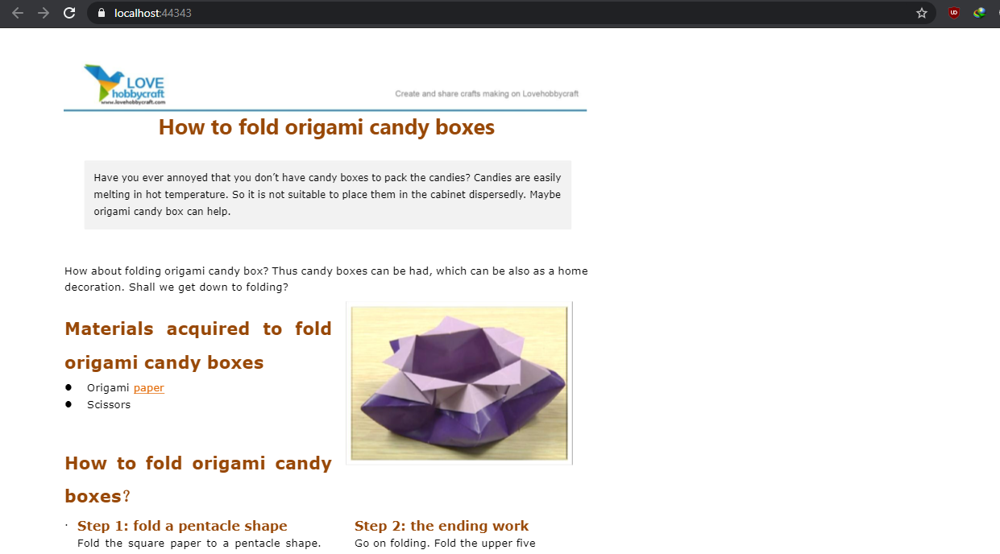
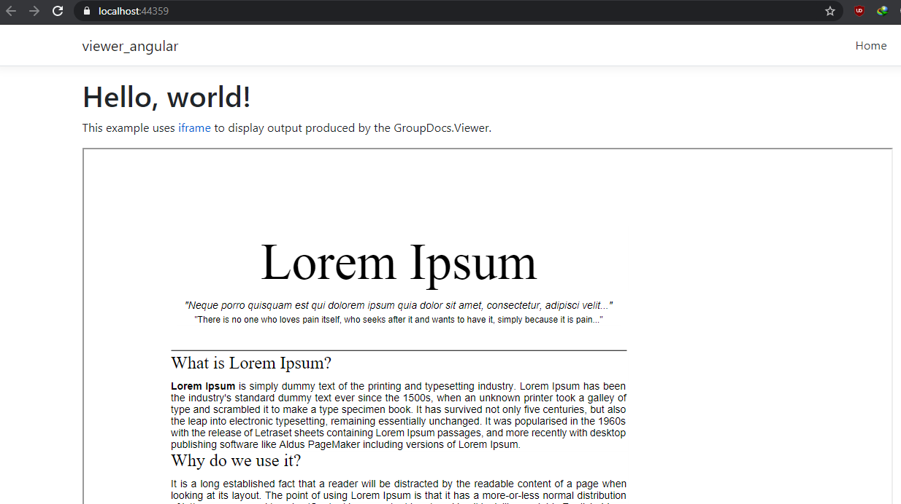

# Display documents from a MemoryStream in ASP.NET MVC/.NET Core
These GroupDocs free consulting projects will help you to render or view a document from stream in your browser. You won't have to download the file in order to display it.  

GroupDocs.Viewer for .NET is a multi-format document viewer [API](https://products.groupdocs.com/viewer/net). Moreover, it is a totally back-end, UI-Agnostic API that could be integrated in any .NET project.

## ASP.NET MVC Document Viewer
This is a basic document viewer application that takes a file as input, [renders it to HTML](https://docs.groupdocs.com/viewer/net/document-viewer-html-viewer/) and returns a stream that is then displayed in the browser. 

## ASP.NET Core API with Angular 
A .Net Core API application with Angular as Front end. Using that you can view all [supported documents](https://docs.groupdocs.com/viewer/net/supported-document-formats/). Pull source file from SQL Server and show it in Angular Front end.

### How to Run
* Download or clone the project
* Restore packages (NuGet & npm)
* Build and run solution

If you don't have a license. You can request a [temporary license](https://purchase.groupdocs.com/buy) in order to evaluate these proejcts without any API limitation. 

## Screenshots
* Sample PDF displayed using ASP.NET MVC application

* Sample PDF displayed using ASP.NET Core API application

# Interested in GroupDocs free consulting project?
[If you are also interested in a free consulting project by GroupDocs team then please view details on this page](https://forum.groupdocs.com/c/free-consulting/37)

If you have any questions about GroupDocs APIs, please feel free to post your query in [GroupDocs Forum](https://forum.groupdocs.com/).

Also, you can keep in touch with the latest developments in file format APIs offered by GroupDocs at our [Blog](https://blog.groupdocs.com/).

# This free consulting project is based on the following issues:
* How to integrate Groupdocs viewer in .Net core and View the document in Angular 7: github.com/groupdocs-free-consulting/projects/issues/8
* I want to be able to display the document in the browser without having to download it: github.com/groupdocs-free-consulting/projects/issues/2

